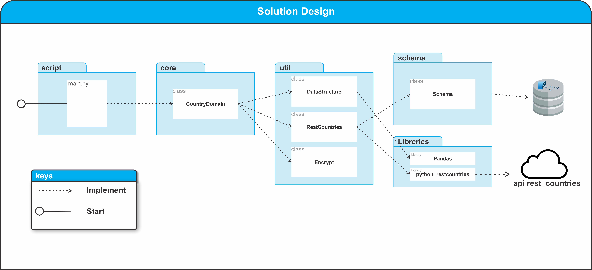

# Countries
Script to export rest_countries result to 
json and save review result on sqlite.
***
## Índice
1. [Features](#features)
2. [Stack](#stack)
3. [Design](#design)
4. [File Structure](#file-structure)
5. [IDE](#ide)
6. [requirements](#requirements)
7. [Deployment](#deployment)
8. [Author](#author)
***

## Features

  - No frameworks
  - use rest_countries
  - use Pandas
  - use SQLite
  - unit test
  - Coverage test

***
## Stack

  - [Python 3.8](https://www.python.org/downloads/release/python-380/)
  - [Poetry](https://python-poetry.org/)
  - [Pandas](https://pandas.pydata.org/docs/index.html#)
  
***
## Design

***
## File Structure
```shell script
.
├── app
│   ├── config
│   │   ├── __init__.py
│   │   └── PARAMETERS.py
│   ├── conftest.py
│   ├── __init__.py
│   ├── src
│   │   ├── core
│   │   │   ├── domain
│   │   │   │   ├── country.py
│   │   │   │   └── __init__.py
│   │   │   └── __init__.py
│   │   ├── __init__.py
│   │   ├── schema
│   │   │   ├── db
│   │   │   │   ├── countries_review.db
│   │   │   │   └── db_test.db
│   │   │   ├── __init__.py
│   │   │   ├── schema.py
│   │   │   └── schemas
│   │   │       ├── base_schema.py
│   │   │       ├── __init__.py
│   │   │       └── sqlite_schema.py
│   │   ├── scripts
│   │   │   ├── __init__.py
│   │   │   └── main.py
│   │   └── util
│   │       ├── data_structure.py
│   │       ├── encrypt.py
│   │       ├── __init__.py
│   │       └── rest_countries.py
│   ├── tests
│   │   ├── __init__.py
│   │   ├── test_core
│   │   │   ├── __init__.py
│   │   │   └── test_domain
│   │   │       ├── __init__.py
│   │   │       └── test_country.py
│   │   ├── test_schema.py
│   │   └── test_util
│   │       ├── data.json
│   │       ├── __init__.py
│   │       ├── test_data_structure.py
│   │       └── test_encrypt.py
│   └── tmp
│       └── json
│           └── data.json
├── poetry.lock
├── pyproject.toml
└── README.md
```
## IDE
  - The project was developed with [PyCharm](https://www.jetbrains.com/es-es/pycharm/) con [licencia de estudiante](https://www.jetbrains.com/es-es/community/education/#students)
  
***
## Requirements
- Poetry
- Python 3.8
## Deployment
- Clone repository from GitHub
```shell script
git clone https://github.com/dexer13/zinobe.git project
cd project
```
- Install packagaes
```shell script
poetry update
```
***
## Tests
Run tests
```shell script
coverage run -m pytest
```
***
### Run Script
To export countries data, execute the next command
```shell script
python app/src/scripts/main.py
``` 
This command generate a json file and a database.
- **json file** app/tmp/json/data.json
- **database** app/src/schema/db/countries_review.db
***
### Autor
The project was developed by:
 - Denis González [GitHub](https://github.com/dexer13) [LinkedIn](https://www.linkedin.com/in/denis-eduardo-isidro-gonzalez-428a51210/)

***